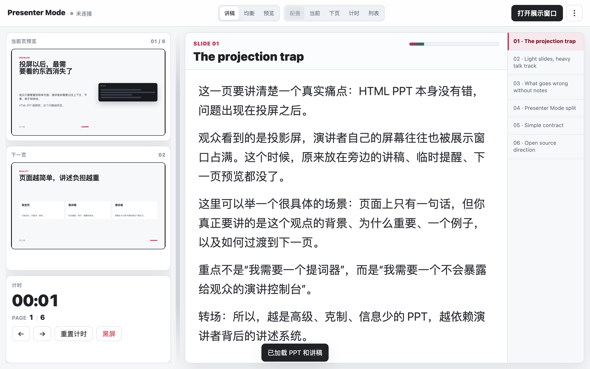
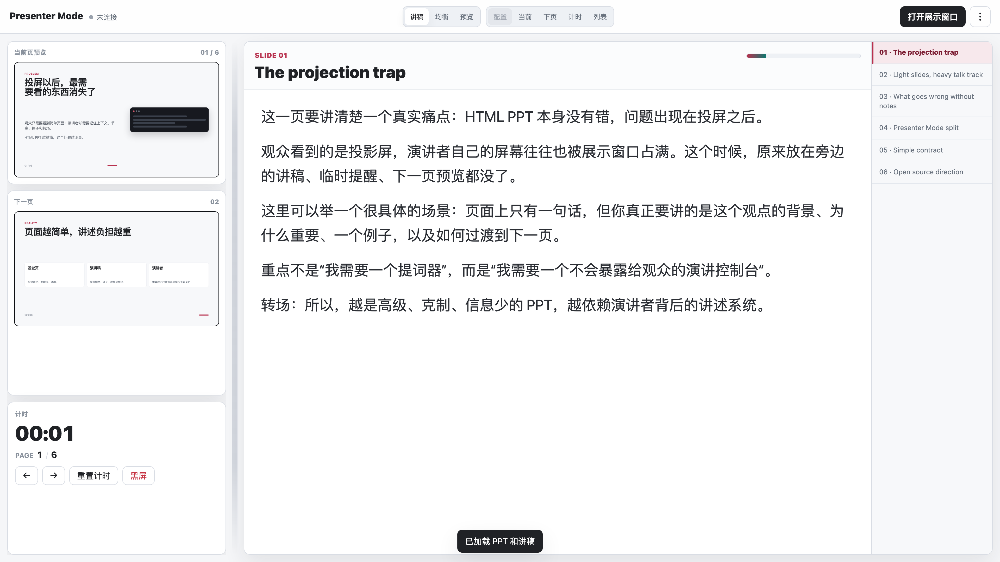

# Presenter Mode

A zero-build presenter view for HTML slide decks.

It gives you a private speaker window with notes, timer, current/next previews, slide list, font controls, collapsible panels, and a separate audience window for projection.




## Features

- 🎯 **Dual-window setup**: Audience sees clean slides, presenter sees notes + previews
- 📝 **Speaker notes**: Markdown format with slide-by-slide notes
- ⏱️ **Timer**: Track presentation time with reset
- 👀 **Preview**: Current and next slide side-by-side
- 📋 **Slide list**: Quick navigation with thumbnails
- 🎨 **Responsive**: Adapts to laptop, tablet, and mobile screens
- 🌓 **Themes**: Light (Sun) and dark (Moon) modes
- 🌍 **i18n**: English and Chinese UI
- 🔧 **Zero-build**: No npm install, no bundler, just open in browser

## Quick Start

### Option 1: Direct Use

```bash
# Start local server
python3 -m http.server 4311

# Open presenter view
open http://127.0.0.1:4311/presenter.html
```

By default, Presenter Mode loads:
- `slides.html` (slide deck)
- `notes.md` (speaker notes)

### Option 2: Custom Paths

```text
presenter.html?slides=path/to/slides.html&notes=path/to/notes.md
```

### Option 3: Install into Existing Project

Use the bundled installation skill (requires Claude Code):

```bash
node skill/add-presenter-mode/scripts/install-presenter-mode.mjs \
  --slides slides.html \
  --notes notes.md
```

This copies the presenter tool into your project and starts a server.

## URL Parameters

| Parameter | Values | Default | Description |
|-----------|--------|---------|-------------|
| `slides` | path | `slides.html` | Path to HTML deck |
| `notes` | path | `notes.md` | Path to Markdown notes |
| `lang` | `en`, `zh` | auto | UI language |
| `theme` | `sun`, `moon` | `sun` | Color theme |
| `layout` | `default`, `notes`, `balanced`, `preview` | `default` | Initial layout |

**Examples:**

```text
presenter.html?slides=deck/index.html&notes=talk/script.md&lang=zh&theme=moon
```

## Slide Deck Requirements

### Minimum Contract

Your HTML deck must have:
- Each slide in a `.slide` element
- Speaker notes use `## 01 Title`, `## 02 Title` format in Markdown

### Recommended API

Expose a navigation API for full control:

```js
window.deck = {
  show(index) {
    // Jump to slide at zero-based index
  },
  next() { this.show(this.current + 1); },
  prev() { this.show(this.current - 1); },
  get current() { return currentSlideIndex; },
  get total() { return totalSlides; }
};
```

Presenter Mode calls `window.deck.show(index)` first. If missing, it falls back to hash navigation (`#1`, `#2`, etc.).

See [skill/add-presenter-mode/SKILL.md](skill/add-presenter-mode/SKILL.md) for deck adaptation patterns.

## Notes Format

Speaker notes use Markdown with numbered headings:

```markdown
## 01 First Slide Title

Speaker notes for slide 1 go here.

Key points:
- Introduce topic
- Set expectations

## 02 The Problem

Explain pain point...
```

**Rules:**
- Headings: `## NN` where NN is slide number (1-based)
- Everything between `## N` and `## N+1` is notes for slide N
- Markdown supported: `**bold**`, `*italic*`, `` `code` ``, lists

## Keyboard Shortcuts

| Key | Action |
|-----|--------|
| `→`, `Space`, `PageDown` | Next slide |
| `←`, `PageUp` | Previous slide |
| `Home`, `End` | First or last slide |
| `B` | Blackout audience window |
| `R` | Reset timer |
| `+`, `-`, `0` | Adjust or reset notes font size |

## Presentation Workflow

1. **Setup**: Open presenter URL on your laptop
2. **Launch audience**: Click "Open audience" button
3. **Position**: Drag audience window to projector screen
4. **Fullscreen**: Press F11 on audience window
5. **Present**: Control slides from presenter window; audience follows automatically

## Browser Compatibility

Tested on:
- Chrome 120+
- Firefox 120+
- Safari 17+
- Edge 120+

Requires modern CSS (Grid, Flexbox, Container Queries) and ES6+ JavaScript.

## Scope

Presenter Mode controls HTML slide decks running in the browser. It does not directly control native desktop presentation apps such as WPS Presentation, Microsoft PowerPoint, or Keynote.

Native app control would require a separate system automation layer or app-specific plugin, which is outside the zero-build browser-only scope of this project.

## Development

See [CONTRIBUTING.md](CONTRIBUTING.md) for development setup and contribution guidelines.

## Test

```bash
npm test
```

Runs smoke test to verify core functionality. No build step required.

## License

MIT — see [LICENSE](LICENSE)
