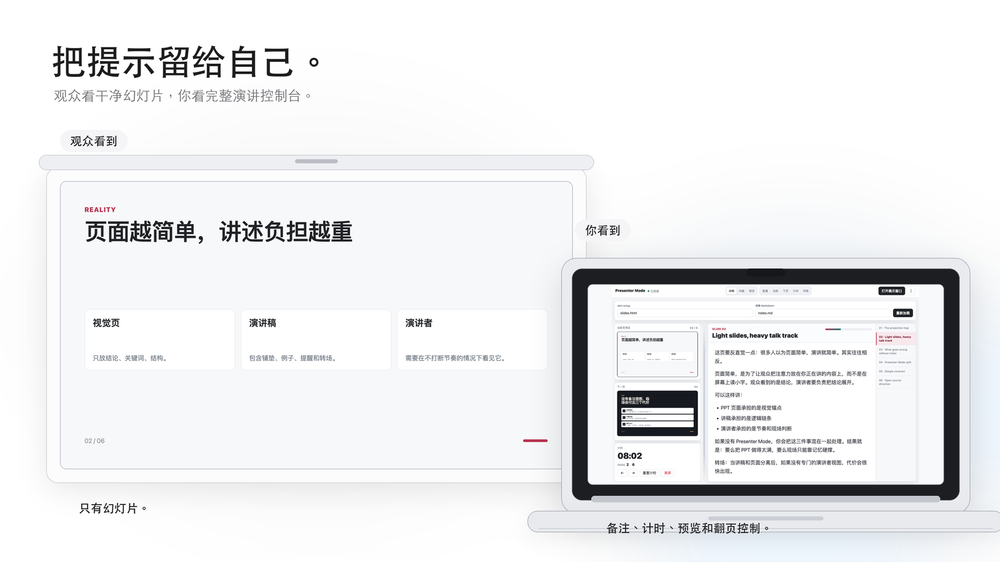
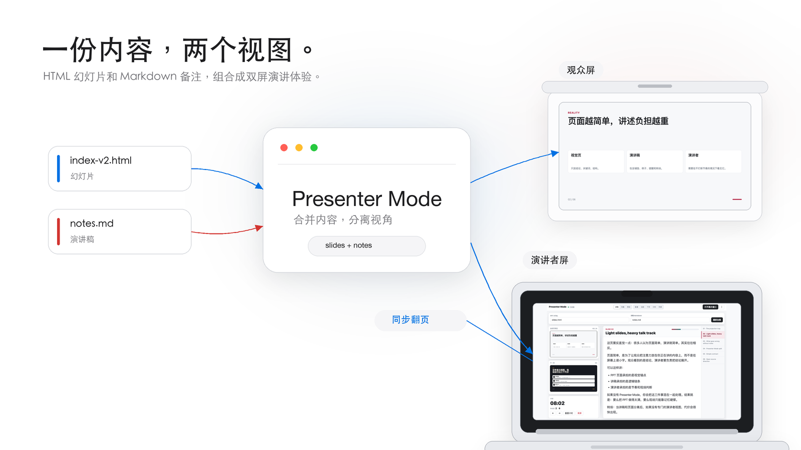

# Presenter Mode（演讲者模式）

[English](#english) | [中文](#中文)

**🔗 在线体验 / Live Demo: [mentran.github.io/presenter-mode](https://mentran.github.io/presenter-mode/)**

---

## 中文

### 这是什么？

你在台上旁征博引、金句频出、复杂概念一字不差——秘密在你的笔记本屏幕上：  
讲稿、计时器、当前页、下一页预览、幻灯片缩略图列表。

观众看到的投影？干净的幻灯片，一个字的提词都没有。

**零构建、零配置、零依赖**——就一个 HTML 文件，浏览器打开就能用。

### 双屏效果





### 界面截图


### 为什么做这个？

**痛点 1：好的演讲需要讲稿，但幻灯片上不能写太多字**  
观众不想看密密麻麻的文字，你需要记住每一页要讲什么、引用哪些数据、该强调哪个观点。  
PowerPoint / Keynote 的演讲者模式解决了这个问题——你能看到备注，观众看不到。

**痛点 2：我的幻灯片是 HTML，没有内置演讲者模式**  
你用 [frontend-slides](https://github.com/zarazhangrui/frontend-slides) 这类 skill、reveal.js、Slidev，或者自己手写 HTML slides 做出了很漂亮的网页 PPT。  
但它通常只解决"把内容做成幻灯片"，不解决"上台时我怎么看讲稿、预览下一页、控制观众屏"。

想要演讲者备注？
- 有的框架需要装插件、改配置，还要学新语法
- 有的框架根本不支持，只能把备注写在浏览器开发者工具的注释里
- 或者…算了，我硬背吧

**痛点 3：不想为了一个演讲者视图搞一套构建流程**  
我就想要个双屏演示：观众看投影，我看讲稿。不想改现有幻灯片的一行代码，不想 `npm install` 一堆依赖。

**解决方案：**  
一个 HTML 文件（57KB），用 `<iframe>` 加载你的幻灯片，用 Markdown 写讲稿。  
本地起个静态服务器（`python3 -m http.server`），打开浏览器，搞定。

### 核心特性

- 🎯 **双窗口设置**：观众看干净的幻灯片，演讲者看讲稿+预览
- 📝 **演讲者备注**：Markdown 格式，逐页显示讲稿，支持加粗、列表、代码
- ⏱️ **计时器**：追踪演讲时间，超时了心里有数
- 👀 **预览**：当前页和下一页并排显示，提前知道下一页要讲什么
- 📋 **幻灯片列表**：缩略图快速导航，讲到一半突然想跳过某页也不慌
- 🎨 **响应式**：适配笔记本、平板、手机屏幕（平板当提词器也能用）
- 🌓 **主题**：浅色（Sun）和深色（Moon）模式，适应不同场地光线
- 🌍 **中英双语**：界面支持中文和英文
- 🔧 **零构建**：无需 npm install，无需打包工具，浏览器直接打开

### 快速开始

最快的方式：直接打开 **[在线 Demo](https://mentran.github.io/presenter-mode/)**，点「打开 Demo」就能体验（无需下载）。

> **在线 Demo 主要用于体验**：你可以用页面上的文件选择器加载本地的幻灯片和讲稿，但幻灯片里用相对路径引用的**本地图片无法显示**（在线页面读不到你磁盘上的图片文件）。要完整使用自己的内容，请按下面的方式在本地运行。

想在本地用你自己的幻灯片，克隆仓库后先跑内置示例：

```bash
# 启动本地服务器
python3 -m http.server 4311

# 浏览器打开演讲者视图（加载 example/ 里的示例幻灯片和讲稿）
open "http://127.0.0.1:4311/presenter.html?slides=example/slides.html&notes=example/notes.md"
```

`presenter.html` 默认会在同级目录找 `slides.html` 和 `notes.md`。所以实际使用时，把 `presenter.html` 放到你幻灯片旁边，或用下面的参数指定路径。

### 用 Claude Code skill 自动安装

如果你在用 [Claude Code](https://claude.ai/code)，这个仓库自带一个 skill，能帮你自动完成安装。

**第一步：安装 skill**

把 skill 目录复制到 Claude Code 的 skills 目录（二选一）：

```bash
# 先克隆本仓库
git clone https://github.com/Mentran/presenter-mode.git

# 装到当前项目（只在这个项目可用）
cp -r presenter-mode/skill/add-presenter-mode .claude/skills/

# 或装到个人目录（所有项目都可用）
cp -r presenter-mode/skill/add-presenter-mode ~/.claude/skills/
```

**第二步：调用 skill**

在你自己的幻灯片项目里，对 Claude Code 说：

```
Add presenter mode to my slides
```

skill 会：
- 自动探测你的幻灯片文件（`slides.html` 或 `index.html`）
- 自动生成讲稿模板（如果 `notes.md` 不存在）——提取幻灯片标题作为章节，你需要填充每页的讲稿内容
- 把 `presenter.html` 复制到你的项目
- 启动本地服务器，给你生成好的演讲者 URL

**注意**：自动生成的 `notes.md` 只是个骨架（每页一个 `## 01`、`## 02` 标题），页数可能不完全准确（取决于幻灯片的 HTML 结构）。使用前请检查并填充你的讲稿内容。

详见 [`skill/add-presenter-mode/SKILL.md`](skill/add-presenter-mode/SKILL.md)。

### 自定义路径

```text
presenter.html?slides=你的幻灯片.html&notes=你的讲稿.md&lang=zh
```

**重要**：路径必须是**相对于 presenter.html 的相对路径**，不要用绝对磁盘路径（`/Users/...`）。

推荐做法：
- **把 `presenter.html` 放到幻灯片所在目录**（和 `index.html` 同层），然后用 `slides=index.html`
- 如果幻灯片在子目录，用 `slides=子目录/index.html`

这样做的原因：
- 幻灯片里的图片、CSS、JS 等资源用的是相对路径（`assets/foo.png`）
- 只有 presenter.html 和幻灯片在同一个 HTTP 服务下，这些资源才能正确加载
- 绝对路径（`/Users/...`）在 HTTP 环境下无法访问

示例目录结构：
```
my-presentation/
  presenter.html    ← 复制到这里
  index.html        ← 幻灯片
  assets/           ← 图片等资源
  notes.md          ← 讲稿
```

启动服务器后访问：
```
http://127.0.0.1:4311/presenter.html?slides=index.html&notes=notes.md
```

### URL 参数

| 参数 | 可选值 | 默认值 | 说明 |
|------|--------|--------|------|
| `slides` | 路径 | `slides.html` | 幻灯片 HTML 文件路径 |
| `notes` | 路径 | `notes.md` | 讲稿 Markdown 文件路径 |
| `lang` | `zh`, `en` | 自动 | 界面语言 |
| `theme` | `sun`, `moon` | `sun` | 配色主题 |
| `layout` | `default`, `notes`, `balanced`, `preview` | `default` | 初始布局 |

### 幻灯片要求

你的 HTML 幻灯片需要满足：
- 每一页是一个 `.slide` 元素
- 讲稿使用 `## 01 标题`、`## 02 标题` 格式的 Markdown

推荐提供导航 API：

```js
window.deck = {
  show(index) { /* 跳转到指定页（index 从 0 开始） */ },
  next() { this.show(this.current + 1); },
  prev() { this.show(this.current - 1); },
  get current() { return 当前页索引; },
  get total() { return 总页数; }
};
```

详细的幻灯片适配方案见 [skill/add-presenter-mode/SKILL.md](skill/add-presenter-mode/SKILL.md)（英文）。

### 讲稿格式

> **本项目暂不提供自动"撰写"讲稿的功能。** 演讲的表达风格、节奏、口吻因人而异，讲稿本身是高度个人化的创作，我们认为这部分更适合由你亲自完成，而不是让工具代笔。skill 只会帮你生成一个带页码标题的空骨架，内容需要你自己填。如果后续这类需求较多，我们会再考虑加入辅助生成能力。

讲稿是一个 Markdown 文件，用 `## 序号 标题` 的格式按页分段：

```markdown
## 01 第一页的标题

这是第一页的演讲者备注。

要点：
- 介绍主题：今天要解决什么问题
- 设定预期：听完能学到什么
- 过渡语：接下来我们看看现状

**重点数据**：根据 2024 年调查，83% 的开发者遇到过这个问题。

## 02 问题所在

开场：「大家有没有遇到过这种情况…」

核心观点：
- 现有方案的三个局限
- 为什么传统做法不够用

引用：Martin Fowler 说过，「…」
```

### 快捷键

| 按键 | 功能 |
|------|------|
| `→` / `Space` / `PageDown` | 下一页 |
| `←` / `PageUp` | 上一页 |
| `Home` / `End` | 第一页或最后一页 |
| `B` | 黑屏观众窗口（中场休息或回答问题时用） |
| `R` | 重置计时器 |
| `+` / `-` / `0` | 调整或重置讲稿字号 |

### 演讲流程

1. 在笔记本上打开演讲者 URL
2. 点击"打开展示窗口"按钮
3. 把弹出的展示窗口拖到投影屏幕
4. 在展示窗口按 F11 进入全屏
5. 在演讲者窗口控制翻页，展示窗口自动同步

**建议：提前彩排一次**，确认讲稿字号、布局、计时器都调好了，演讲当天直接开讲。

### 局限性

**这个工具适合：**
- ✅ 你已经有 HTML 幻灯片，只是想要个演讲者视图
- ✅ 你的幻灯片结构简单（线性翻页，没有复杂的嵌套或动态路由）
- ✅ 你愿意用 Markdown 写讲稿（不想嵌在幻灯片 HTML 里）
- ✅ 你需要在演讲时看讲稿、计时、预览下一页

**这个工具不适合：**
- ❌ 你还没有幻灯片，想从零开始做演示 → 直接用 **reveal.js / Slidev / Sli.dev** 更合适
- ❌ 你的幻灯片有复杂的嵌套结构或自定义路由 → 需要深度适配，可能不值得
- ❌ 你想要实时协作、云端同步、自动录制 → 用 **Google Slides / Pitch**
- ❌ 你的演讲不需要讲稿（演讲大师或者完全即兴）→ 那你不需要这个工具

### 开发与测试

```bash
# 测试
npm test

# 开发（打开示例）
python3 -m http.server 4311
open "http://127.0.0.1:4311/presenter.html?slides=example/slides.html&notes=example/notes.md"
```

### 许可证

MIT — 见 [LICENSE](LICENSE)

---

## English

### What is this?

You're on stage dropping references, memorable quotes, complex concepts word-perfect — the secret is on your laptop screen:  
Speaker notes, timer, current slide, next slide preview, thumbnail list.

The audience sees the projector? Clean slides with zero visible prompts.

**Zero-build, zero-config, zero-dependency** — just one HTML file, open in browser and go.

### Dual-Screen Experience


### Screenshots


### Why build this?

**Pain point 1: Good presentations need speaker notes, but slides can't be text-heavy**  
Audiences don't want walls of text. You need to remember what to say on each slide, which data to cite, which points to emphasize.  
PowerPoint / Keynote presenter mode solves this — you see notes, audience doesn't.

**Pain point 2: My slides are HTML, no built-in presenter mode**  
You're using a skill like [frontend-slides](https://github.com/zarazhangrui/frontend-slides), reveal.js, Slidev, or hand-crafted HTML slides to make polished web presentations.  
But those tools usually solve "turn content into slides", not "show my notes, next slide preview, and audience controls while presenting".

Want speaker notes?
- Some frameworks need plugins, config changes, and learning new syntax
- Some frameworks don't support it at all — you're stuck putting notes in HTML comments and opening DevTools
- Or… nevermind, I'll just memorize everything

**Pain point 3: Don't want a build pipeline just for a presenter view**  
I just want dual-screen: audience sees projector, I see notes. Don't want to modify existing slides, don't want to `npm install` a pile of dependencies.

**Solution:**  
One HTML file (57KB), loads your slides in an `<iframe>`, notes in Markdown.  
Start a static server (`python3 -m http.server`), open browser, done.

### Features

- 🎯 **Dual-window setup**: Audience sees clean slides, presenter sees notes + previews
- 📝 **Speaker notes**: Markdown format with per-slide notes, supports bold, lists, code
- ⏱️ **Timer**: Track presentation time, know when you're running over
- 👀 **Preview**: Current and next slide side-by-side, see what's coming
- 📋 **Slide list**: Quick navigation with thumbnails, skip slides mid-presentation without panic
- 🎨 **Responsive**: Adapts to laptop, tablet, mobile screens (use tablet as teleprompter)
- 🌓 **Themes**: Light (Sun) and dark (Moon) modes for different venue lighting
- 🌍 **i18n**: English and Chinese UI
- 🔧 **Zero-build**: No npm install, no bundler, just open in browser

### Quick Start

Fastest way: open the **[live demo](https://mentran.github.io/presenter-mode/)** and click "打开 Demo" — no download needed.

> **The live demo is mainly for trying it out**: you can load your own slides and notes via the file picker, but **local images referenced by relative paths in your deck won't display** (the hosted page can't read image files off your disk). To use your own content fully, run it locally as shown below.

To use your own deck locally, clone the repo and try the built-in example first:

```bash
# Start local server
python3 -m http.server 4311

# Open presenter view (loads the example deck and notes in example/)
open "http://127.0.0.1:4311/presenter.html?slides=example/slides.html&notes=example/notes.md"
```

By default `presenter.html` looks for `slides.html` and `notes.md` next to it. In real use, drop `presenter.html` beside your deck, or point to paths with the params below.

### Use Claude Code skill for automatic setup

If you're using [Claude Code](https://claude.ai/code), this repo ships a skill that automates the setup.

**Step 1: Install the skill**

Copy the skill directory into Claude Code's skills folder (pick one):

```bash
# Clone this repo first
git clone https://github.com/Mentran/presenter-mode.git

# Install for the current project (available in this project only)
cp -r presenter-mode/skill/add-presenter-mode .claude/skills/

# Or install personally (available in all your projects)
cp -r presenter-mode/skill/add-presenter-mode ~/.claude/skills/
```

**Step 2: Invoke the skill**

In your own slide-deck project, tell Claude Code:

```
Add presenter mode to my slides
```

The skill will:
- Auto-detect your slide deck (`slides.html` or `index.html`)
- Generate speaker notes template if `notes.md` doesn't exist — extracts slide titles as section headers; you'll need to fill in the actual notes for each slide
- Copy `presenter.html` to your project
- Start a local server and give you the presenter URL

**Note**: The auto-generated `notes.md` is just a skeleton (one `## 01`, `## 02` heading per slide). The page count may not be perfectly accurate depending on your deck's HTML structure. Review and fill in your speaker notes before use.

See [`skill/add-presenter-mode/SKILL.md`](skill/add-presenter-mode/SKILL.md) for details.

### Custom Paths

```text
presenter.html?slides=path/to/slides.html&notes=path/to/notes.md&lang=en
```

**Important**: Paths must be **relative to presenter.html**, not absolute disk paths (`/Users/...`).

Recommended approach:
- **Place `presenter.html` in the same directory as your slide deck** (next to `index.html`), then use `slides=index.html`
- If your deck is in a subdirectory, use `slides=subdirectory/index.html`

Why this matters:
- Your deck's images, CSS, and JS use relative paths (`assets/foo.png`)
- These resources only load correctly when presenter.html and the deck are served from the same HTTP server
- Absolute paths (`/Users/...`) are not accessible in an HTTP context

Example directory structure:
```
my-presentation/
  presenter.html    ← copy here
  index.html        ← slide deck
  assets/           ← images and resources
  notes.md          ← speaker notes
```

After starting a server, visit:
```
http://127.0.0.1:4311/presenter.html?slides=index.html&notes=notes.md
```

### URL Parameters

| Parameter | Values | Default | Description |
|-----------|--------|---------|-------------|
| `slides` | path | `slides.html` | Path to HTML deck |
| `notes` | path | `notes.md` | Path to Markdown notes |
| `lang` | `en`, `zh` | auto | UI language |
| `theme` | `sun`, `moon` | `sun` | Color theme |
| `layout` | `default`, `notes`, `balanced`, `preview` | `default` | Initial layout |

### Slide Deck Requirements

Your HTML deck must have:
- Each slide in a `.slide` element
- Speaker notes use `## 01 Title`, `## 02 Title` format in Markdown

Recommended navigation API:

```js
window.deck = {
  show(index) { /* Jump to slide at zero-based index */ },
  next() { this.show(this.current + 1); },
  prev() { this.show(this.current - 1); },
  get current() { return currentSlideIndex; },
  get total() { return totalSlides; }
};
```

See [skill/add-presenter-mode/SKILL.md](skill/add-presenter-mode/SKILL.md) for detailed deck adaptation patterns.

### Notes Format

> **This project does not auto-*write* your speaker notes.** Delivery style, pacing, and voice differ from person to person — notes are a deeply personal piece of creative work, and we believe this part is best written by you rather than ghostwritten by a tool. The skill only scaffolds an empty outline with numbered headings; the content is yours to fill in. If there's enough demand later, we may consider adding assisted generation.

Notes are a Markdown file, split per slide with `## NN Title` headings:

```markdown
## 01 First Slide Title

Speaker notes for slide 1.

Key points:
- Introduce topic: what problem are we solving today
- Set expectations: what will you learn
- Transition: "Let's look at the current state..."

**Key stat**: According to 2024 survey, 83% of developers face this issue.

## 02 The Problem

Opening: "Has anyone here experienced this..."

Core argument:
- Three limitations of existing solutions
- Why traditional approaches fall short

Quote: Martin Fowler said, "..."
```

### Keyboard Shortcuts

| Key | Action |
|-----|--------|
| `→` / `Space` / `PageDown` | Next slide |
| `←` / `PageUp` | Previous slide |
| `Home` / `End` | First or last slide |
| `B` | Blackout audience window (for breaks or Q&A) |
| `R` | Reset timer |
| `+` / `-` / `0` | Adjust or reset notes font size |

### Presentation Workflow

1. Open presenter URL on your laptop
2. Click "Open audience" button
3. Drag audience window to projector screen
4. Press F11 on audience window for fullscreen
5. Control slides from presenter window; audience follows automatically

**Tip: Rehearse once** to dial in notes font size, layout, and timing. On presentation day, just start.

### Limitations

**This tool is for you if:**
- ✅ You already have HTML slides and just want a presenter view
- ✅ Your slides are simple (linear navigation, no complex nesting or dynamic routing)
- ✅ You're okay writing speaker notes in Markdown (not embedded in slide HTML)
- ✅ You need to see notes, timer, and next slide preview while presenting

**This tool is NOT for you if:**
- ❌ You don't have slides yet and want to build from scratch → Use **reveal.js / Slidev / Sli.dev** instead
- ❌ Your slides have complex nested structures or custom routing → Deep adaptation required, might not be worth it
- ❌ You want real-time collaboration, cloud sync, auto-recording → Use **Google Slides / Pitch**
- ❌ You don't need notes (presentation master or fully improvised) → You don't need this tool

### Development & Testing

```bash
# Test
npm test

# Develop (open the example)
python3 -m http.server 4311
open "http://127.0.0.1:4311/presenter.html?slides=example/slides.html&notes=example/notes.md"
```

### License

MIT — see [LICENSE](LICENSE)
